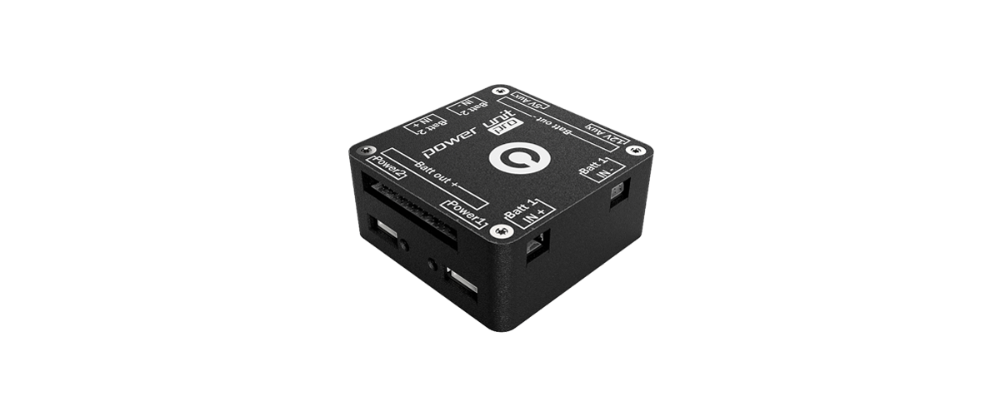

# Power Management Unit

The Power Management Unit _\(shortened to PMU in this book\)_ was designed by Drotek and released in the late 2017. Conceived to work specifically with the Pixhawk 3 PRO autopilot from Drotek, any autopilot and devices can benefit from its **double battery capacity**, providing **two 5V power supplies** or a **redundant** one for your autopilot, and adding work time to your setup, as well as its built-in high-end **voltage and current sensing** which will provide you with additional crucial **real-time flight informations**. It's **ESCs powering bay** will also be very helpful to have a clean setup and avoid messy cables.

[Get more information and shop here.](https://store.drotek.com/power-management-unit-pro)

