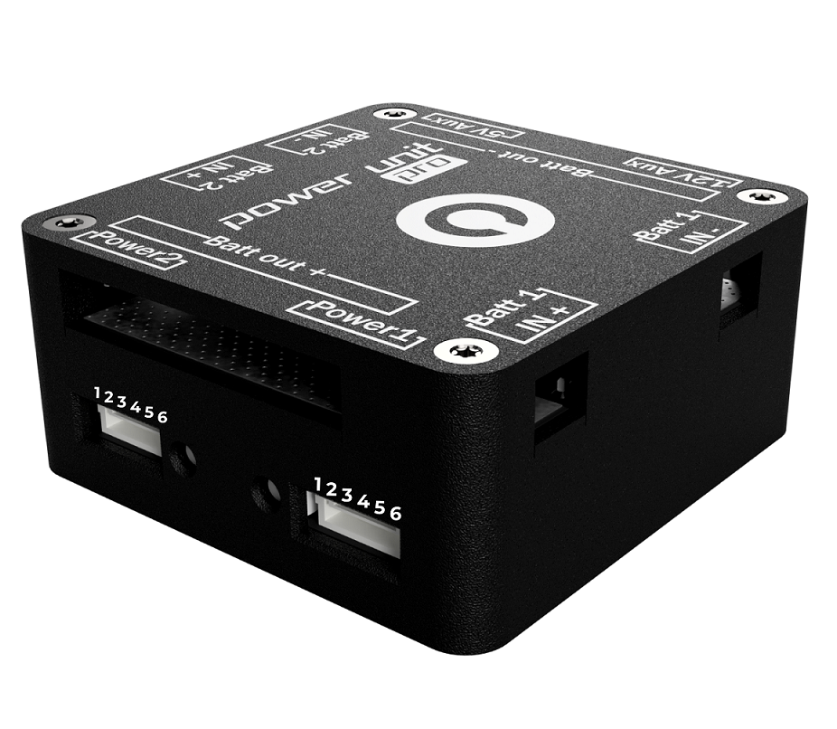
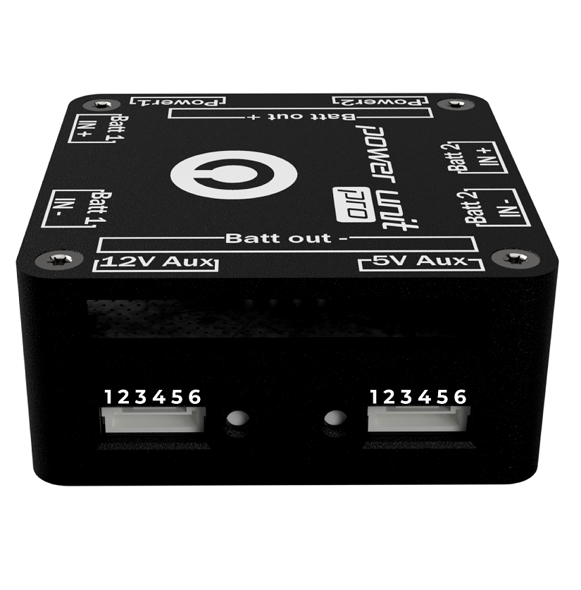

# Wiring

The differents wirings of the outputs of the Power Management Unit are compliant to standards regarding their pinout. You can find the exact pinout of the four outputs below.

## Power outputs

The pinout of both _POWER1_ and _POWER2_ outputs is the same. You'll find the number of each pin of the connector on the picture and its corresponding signal in the table underneath the picture.

### POWER 1 & 2 Outputs

| Wire N° | Corresponding pinout |
| :--- | :--- |
| 1 | 5V |
| 2 | 5V |
| 3 | I Sense |
| 4 | V Sense |
| 5 | GND |
| 6 | GND |

## Auxiliary outputs

Although the two outputs _5V AUX_ and _12V AUX_ deliver different voltages, they are both routed the same way, so that the only difference between the two outputs is the voltage supplied. Even though these two outputs differ only in their voltage output, you'll find both pinouts for these two connectors. You can look up the numbers on the picture and see the corresponding signal in the table below.

### 5V AUX Output

| Wire N° | Corresponding pinout |
| :--- | :--- |
| 1 | 5V |
| 2 | 5V |
| 3 | 5V |
| 4 | GND |
| 5 | GND |
| 6 | GND |

### 12V AUX Output

| Wire N° | Corresponding pinout |
| :--- | :--- |
| 1 | 12V |
| 2 | 12V |
| 3 | 12V |
| 4 | GND |
| 5 | GND |
| 6 | GND |

